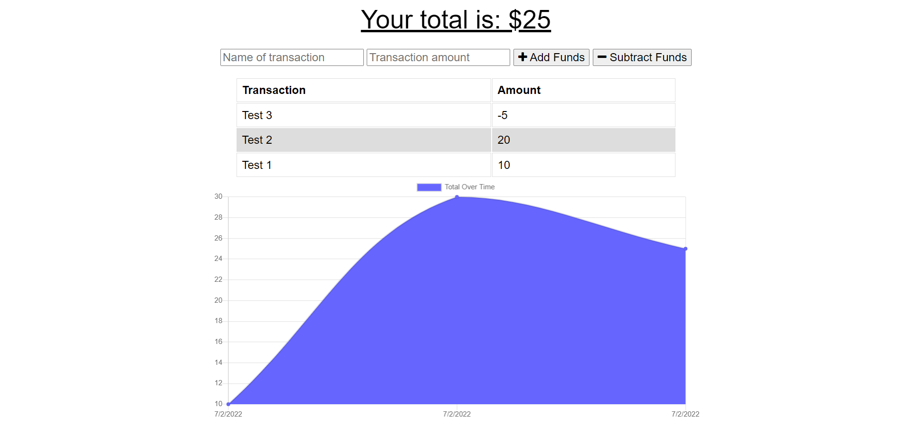
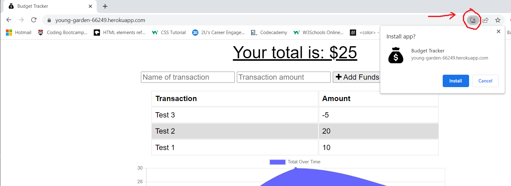
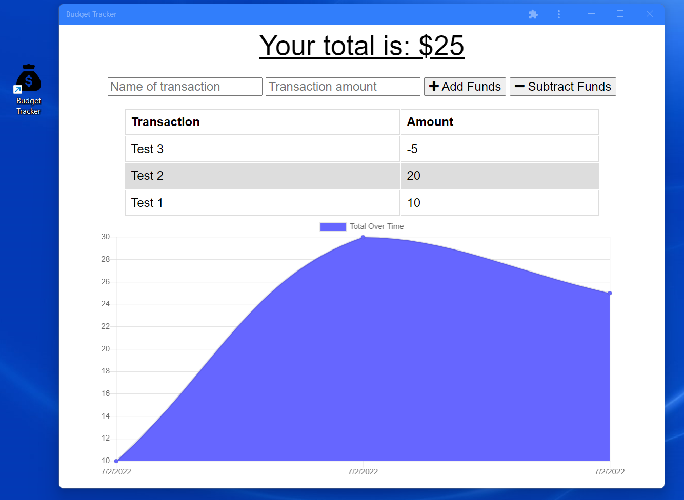

# Budget Tracker
Week 19 Challenge - Progressive Web Application Budget Tracker

## Description

An app that allows a user to track their budget. Created using HTML, JavaScript, Node.js, CSS, Express.js, and utilizes service workers, and indexedDB for offline functionality.

## Table of Contents
* [Installation](#installation)
* [Usage](#usage)
* [Tests](#tests)
* [Links](#links)

---
## Installation

**To install packages**

If running locally, type the following at the root directory in a bash prompt to install dependencies: 
*"npm i"*

**To start the server**

Type the following in a bash terminal at the root of the directory: 
*"npm start"*

**Run via Heroku**

Or visit:
*https://young-garden-66249.herokuapp.com/*

---
## Usage

The user is presented with a simple budgeting tool, which allows them to add or subtract amounts to their budget. The user can name the transaction, and once added, this record is listed above the graph.

The user does not need to be connected to the internet to use the app. Upon first loading, the site is cached, and if the internet connection is lost then the site will still display. The user can also add budget entries while offline, which will sync with the database once the connection is re-established. There is also the option for the user to download a version to their desktop or mobile device, which acts like an app. This is done by clicking the 'install' icon on the right side of the browser's address bar.

---
## Tests

Budget Tracker Homepage

PWA Install

PWA Version and Desktop Icon

---
## Links

[Budget Tracker on GitHub](https://github.com/philmcgarty/budget-tracker)

[Budget Tracker Deployed on Heroku](https://young-garden-66249.herokuapp.com/)